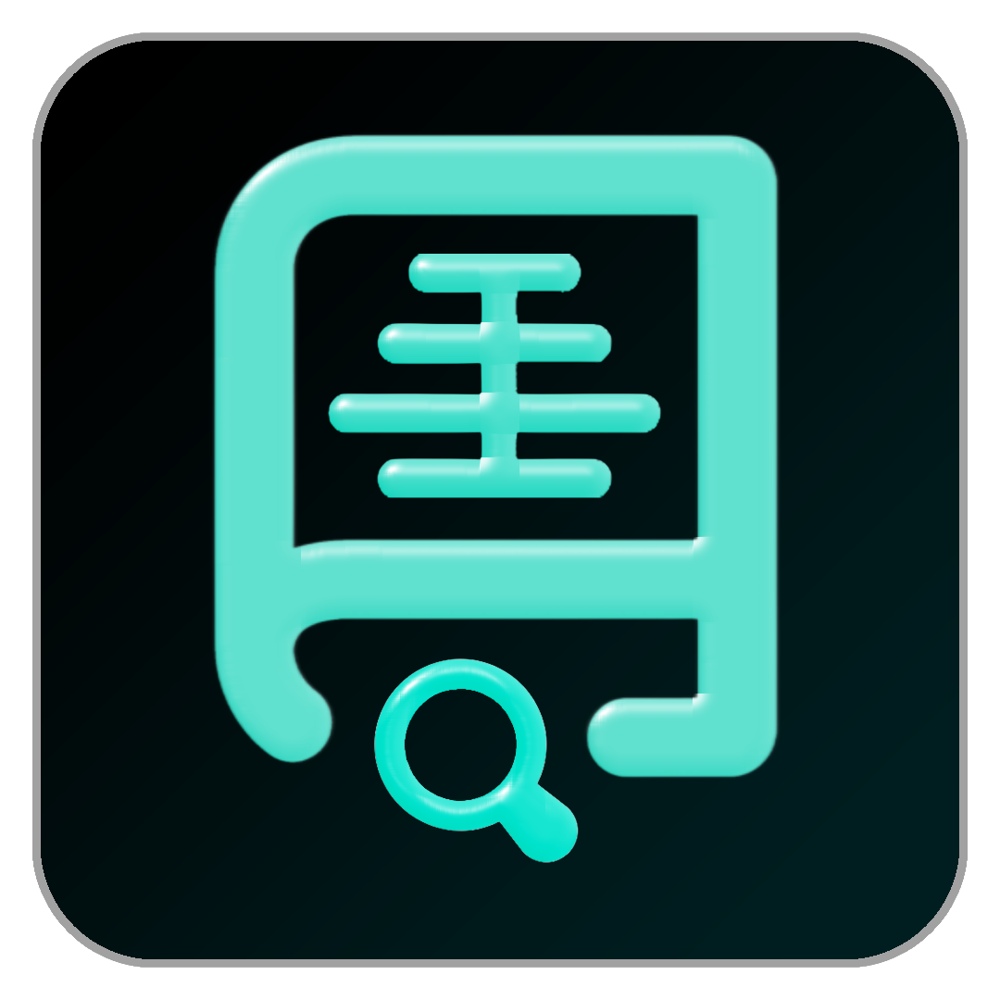
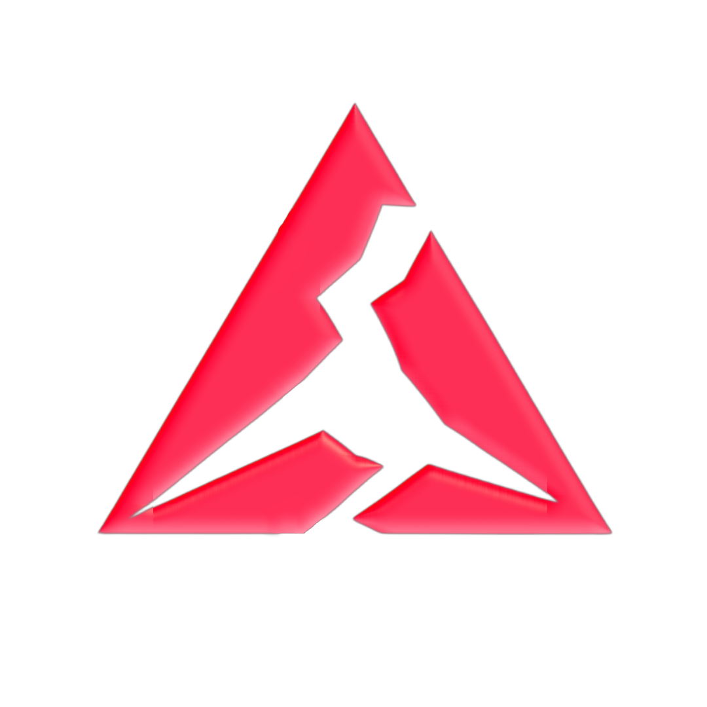
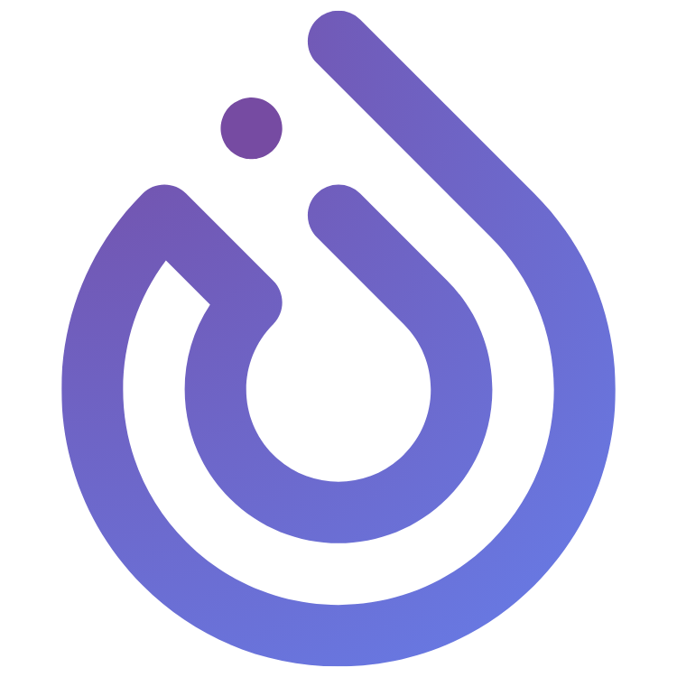
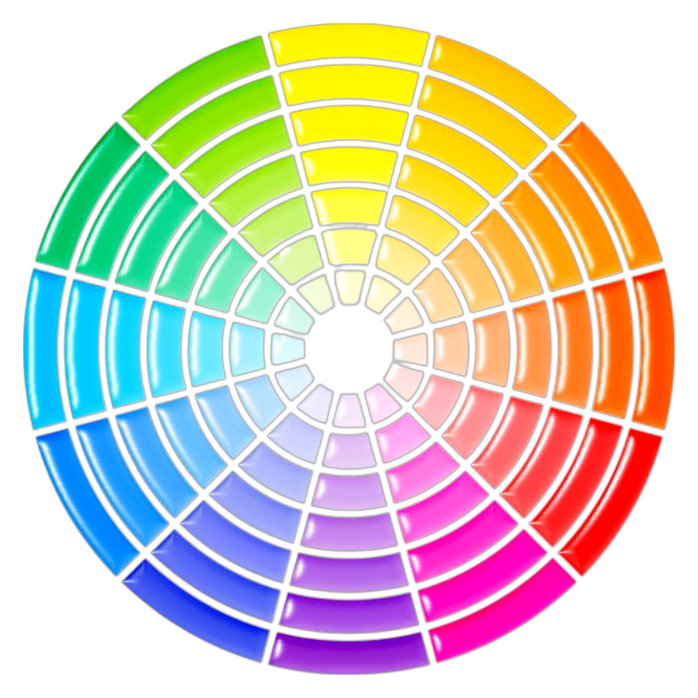
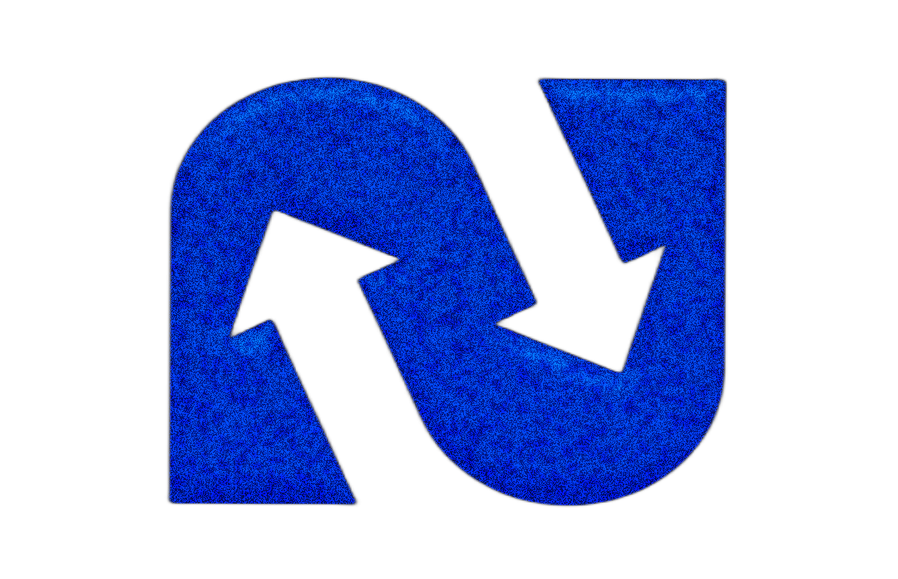
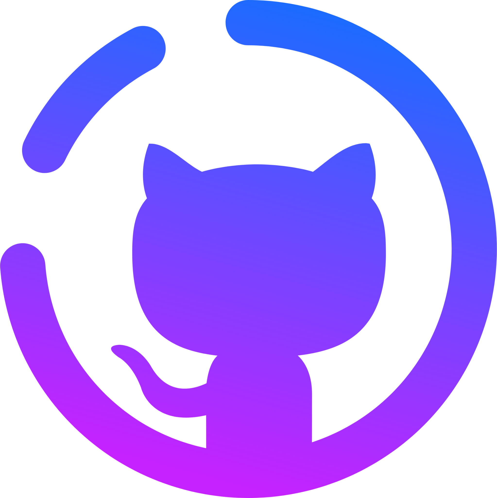
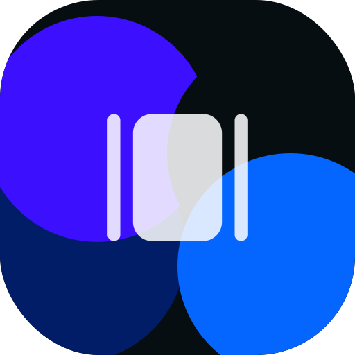
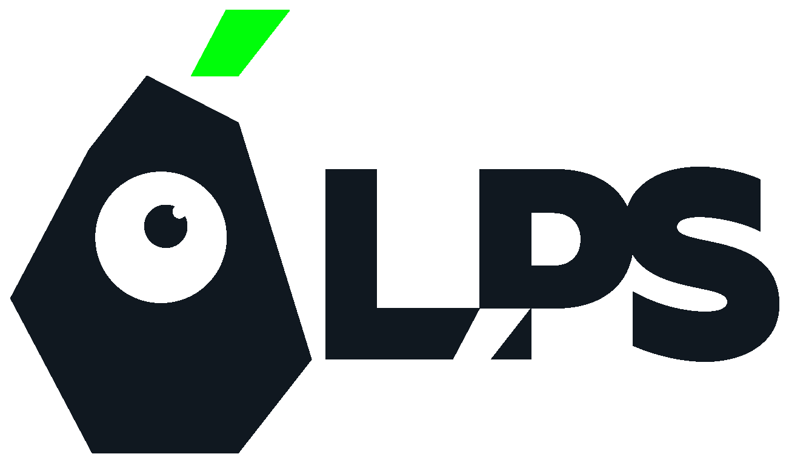
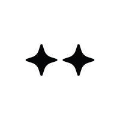

 

look at you... you found  
<h1 align="center">The glitch in this fucking matrix.</h1>

### This is aashuu ✦ 𝘱𝘰𝘭𝘺𝘮𝘢𝘵𝘩
Professionally, an Entrepreneur

> I solve expensive problems for those who don’t care about the price.

> I design attraction that put wow factor in every business/person.
  
> I build dominant software/products through obsession and creative creation.

> I sell urgency that creates a market to buy water in the middle of the sea.

I'm on a mission for the last 4 years to build my own ecosystem of every product or software that I need or use. Till now, I have built 50+ production-grade SaaS across every layer of the internet (Web2 ▪︎ Web3 ▪︎ AI) that will brutally dominate in so many unfair and fucking ways. (32 delivered to clients, the rest are personal.)

---

###  Founder ✦ DevDisplay Ecosystem (Platform ▪︎ Labs ▪︎ Community)

The First Global Platform for Developers to Fulfill All Their Tech Needs.

Organization ✦ <a href="https://github.com/devdisplay"><strong>GitHub</strong></a> ▪︎ <a href="https://www.devdisplay.org/"><strong>Website</strong></a>

> 500+ Global Developers ▪︎ 17000+ Community Member

<!-- `
-->

---

## Latest Build

-  **[RepoXray - soon](#)** - Understand Any Codebase X-Ray Any Repo , in Seconds.
-  **[AVSAR - soon](#)** - The Intelligence System for Modern Events.
-  **[Enough](https://enough.aashuu.tech/)** - Clean. Detect. Generate. In Seconds. (#1 on Peerlist)
-  **[Proof of Failure](https://proofoffailure.works/)** - Before POW, study POF. Backed by $258.4B Burned Capital
-  **[Safenote](https://www.safenote.me/)** - The safest workspace to store and share your private notes & messages!
-  **[ColorTones](https://colortones.aashuu.tech/)** - The perceptual DNA of color. Transform colors into full palettes effortlessly.
-  **[Antriview](https://antriview.systems/)** - Your AI Interviewer That Prepares You Better Than Any Human Can.
-  **[NextJS API Decorators](https://nextjs-api-decorators.vercel.app/)** - Collection of clean, typed API routes with built-in validation and request transformation
-  **[Coding Aura](https://codingaura.vercel.app/)** - Flex Your Coding Journey on Social. Generate. Download. Share.
-  **[GitHub Legacy](https://github-legacy.vercel.app/)** - Transform your GitHub journey into a professional resume in seconds!
-  **[Gradiee](https://gradiee.vercel.app/)** - open-source amazing gradient wallpaper generator.
-  **[Resume Builder](https://resume-builder-pro.vercel.app/)** - Create your Resume in minutes using ATS proof template!
-  **[Helpmate AI](https://helpmate-ai.vercel.app/)** - #1 ChatBot of Gemini API (Featured in Google AI developer competition.

---

## Legacy Build
-  **[LPS Brands](https://lps-me.com/)** - LPS is a New-Age 360° full-impact agency, building identities, communications & digital experiences for modern brands with measurable impact.
-  **[Uniqual ITech](https://uniqualitech.com/)** - Powerhouse That Delivers High Quality IT
-  **[Lightship](https://lightshiprv.com/)** - Lightship is the first American all-electric recreational vehicle company bringing travel trailers into the electric age.
-  **[MOQO](https://moqo.be/)** - MOQO develops brands from a well-thought-out brand strategy, whether in terms of corporate branding, product branding or employer branding.
-  **[Lazarev](https://www.lazarev.agency/)** - Award-winning digital product design agency for AI-driven B2B platforms. $500M+ raised by clients through design-led growth.
-  **[Selemen](https://selemen.liqium.com/)** - Selemen® provides a full range of services for interior decoration and construction solutions turnkey for residential and commercial construction.
-  **[Rejouice](https://www.rejouice.com/)** - REJOUICE is venture firm and digital agency that transforming visions into brands. From strategy to execution, performance, and ongoing support.

---

##  What I'm Doing

- **Living in the future** — Engineering software and tools to accelerate agentic engineering, physical AI, conversational AI, and Web3, making them faster, simpler, and accessible to everyone.
- **Available for contract-based projects** — For brands, business agencies, enterprises, founders, and professionals to create a WoW factor by delivering AI-powered SaaS products (web apps), creative design, attractive and repetitive branding, unfair and dark growth strategies, AI integration, decentralized AI infrastructure, and scalable architected systems. 
- **Also Available for (full-time or part-time)** — For those who prioritize high-impact outcomes over price.
- **Rapid prototyping & MVPs** — Deliver in days, not months (web ▪︎ apps ▪︎ AI ▪︎ SaaS ▪︎ systems ▪︎ design ▪︎ growth)
- **Writing Banger Articles** — On technology, internet, AI, the future, unfair advantage, psychology, money, power, obsession, pattern recognition, and dark secrets & strategies to dominate anything, engineered to shift perspective and create leverage ▪︎ All articles available on [LinkedIn](https://www.linkedin.com/build-relation/newsletter-follow?entityUrn=7432462296746184704) ▪︎ [Medium](https://medium.com/@warrioraashuu) ▪︎ [Peerlist](https://peerlist.io/aashuu/articles) ▪︎ [Substack](https://substack.com/@warrioraashuu/posts)
- **Judged & Mentored 15+ Tech Initiatives** — Across hackathons, startups, idea pitches, and open-source programs & ecosystems.

---

##  Latest Banger Articles

> ⚠️ The sharpest articles on the internet! Read at your own risk, this will rewire your mind with a banger. You won’t be the same after this.

- [There’s No Fucking Fear Once You Understand The Pattern.](https://medium.com/@warrioraashuu/theres-no-fucking-fear-once-you-understand-the-pattern-5f5513b2a5bb)
- [The Future of AI Belongs to Bharat.](https://medium.com/@warrioraashuu/the-future-of-ai-belongs-to-bharat-beb471c2aaa0)
- [Don’t Turn 2026 Into Another Wasted Fucking Year.](https://medium.com/@warrioraashuu/the-future-of-ai-belongs-to-bharat-beb471c2aaa0)
- [The Big Lie About Your Fucking Competition](https://medium.com/@warrioraashuu/the-big-lie-about-your-fucking-competition-f1a8b3573c36)
- [How Dirty Money Actually Moves](https://medium.com/@warrioraashuu/the-big-lie-about-your-fucking-competition-f1a8b3573c36)

 ** Click to read more bangers:**  
[Medium](https://medium.com/@warrioraashuu) ▪︎ [Peerlist](https://peerlist.io/aashuu/articles) ▪︎ [Substack](https://substack.com/@warrioraashuu/posts) ▪︎ [LinkedIn Newsletter](https://www.linkedin.com/build-relation/newsletter-follow?entityUrn=7432462296746184704) 

---

## Philosophy
> Life is a battlefield. You can’t find peace without battle, because the path to peace is the last door to war. So be a warrior and win your battle... Always remind yourself `अहमस्मि योधः`

 

     

 

Holder of  Across Projects.

---

<table align="center" width="100%" style="border: 1px solid #444; border-radius: 12px; background-color: #f9f9f9;">
  <tr>
    <!-- Left Side -->
    <td align="center" style="padding: 20px; width: 70%;">
      
<strong>Invited you to be part of a global developer vision

      
        
      
    </td>
    <!-- Right Side (Logo Icon) -->
    <td align="center" style="padding: 20px; width: 30%;">
      
    </td>
  </tr>
</table>

  

<!--  -->

<!-- <h3 align="center">📊 Stats of Obsession</h3>

 -->

<!--- 

 --->

<!---  --->

 <!--## 💌 Sponser

  

 

-->

<!-- <h2 align="center">Dev Legacy!<h2>

  
  
  

  

 

<h1> Dev Legacy! </h1>

|  |  |  |
| ------------------------------------------------------- | -------------------------------------------------------- | --------------------------------------------------------- |

 -->
