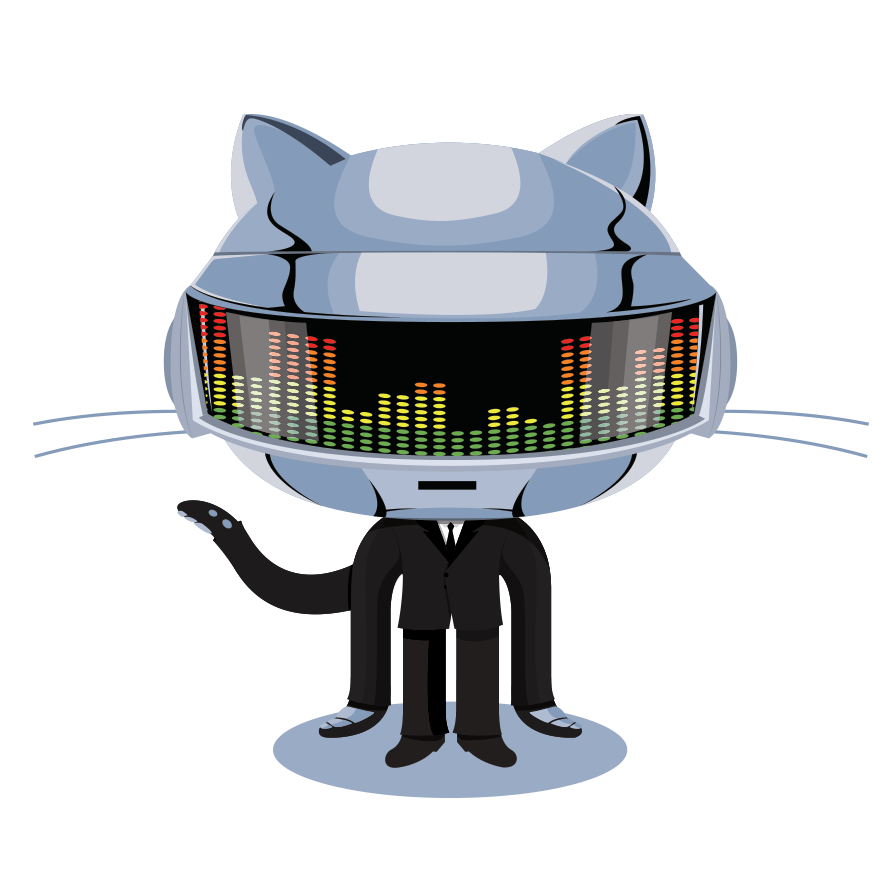

	
<h1 align="center"> This is aashuu - The glitch in your perfect system.</h1>

<table>
  <tr>
    <td valign="top">
      <ul style="list-style: none; padding-left: 0;">
        

           
        

        <h3 align="center">
          Turning pixels into production-ready products for the past 3 years with a mind full of fucking obsessed creativity.
            
          Till now, I have built 50+ web apps.
           (19 delivered to clients, the rest are personal.)
          

        </h3>
        <li>Building DevDisplay - A tech ecosystem running on 3 business models: Platform, Labs, and Community.</li>
        <li>Lead Product Engineer at a Dubai-based service company (LPS), driving 8 teams to build scalable microservices and AI platforms that turn content into tradable assets.</li>
        <li>Open Source Mentor at Hacktoberfest 2024, GirlScript Summer of Code (23,24), IEEE IGDTUW Open Source Week 2024, Social Winter of Code (23,24), Kharagpur Winter of Code 24, NJACK Winter of Code, IIT Patna OS Month 2024, Script Winter of Code (24,25).</li>
        <li>Mostly spending working time on Conversational AI, Next.js, Branding (Startups, Professional), open source, and also learning LLMs.</li>
        <li>Available only for contract-based freelance projects in Web App Development, UI/UX, and Brand Design.</li>
        <li>Pursuing a Bachelor's in Computer Science (CSE - Final Year).</li>
      </ul>
    </td>
    <!-- RIGHT SIDE IMAGE + SOCIAL LINKS -->
    <td align="center" valign="top" width="300">
      <!-- Coding GIF -->
       
      <!-- Social Links -->
        
       
      
      
      
      
      
      
      
      
      
      
      
      
      
    </td>
  </tr>
</table>

 

<!--<h2 align="center">Dev Legacy!<h2>

  
  
  

-->

<!--  -->
	
<!--  -->

<!--

<h1> Dev Legacy! </h1>

|  |  |  |
| ------------------------------------------------------- | -------------------------------------------------------- | --------------------------------------------------------- |

-->

<h3 align="center">📊 Stats of Obsession</h3>

  

<!--- 

 --->

<!---  --->

 

	
### **Thanks for checking out my GitHub Profile!**  

 ## 💌 Sponser

  

  
